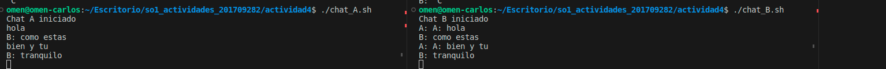

## Definición del Named Pipe (PIPE_A_B):

```PIPE_A_B="/tmp/chat_pipe_A_B"```

Se define la ruta del named pipe como "/tmp/chat_pipe_A_B". Este será el canal de comunicación entre los dos scripts.

## Creación del Named Pipe:


```[ -p "$PIPE_A_B" ] || mkfifo "$PIPE_A_B"```

Se verifica si el named pipe ya existe ([ -p "$PIPE_A_B" ]). Si no existe, se crea con mkfifo.

## Apertura del Named Pipe para Lectura y Escritura:

```exec 3<> "$PIPE_A_B"```

Se abre el named pipe ("$PIPE_A_B") para lectura (<) y escritura (>), y se asocia al descriptor de archivo 3.

## Bucle Principal:

```while true; do```

Inicia un bucle infinito para la lectura y escritura continua.

## Lectura de Mensaje desde la Entrada Estándar (read -r message):

```read -r message```

Lee un mensaje desde la entrada estándar (stdin) y lo almacena en la variable message.

## Escritura del Mensaje en el Named Pipe (echo "A: $message" > "$PIPE_A_B"):

```echo "A: $message" > "$PIPE_A_B"```

Escribe el mensaje precedido por "A:" en el named pipe, que será leído por el otro script.

## Forzar la Escritura (sync):

```sync```
Forzar la escritura antes de continuar

Utiliza sync para forzar la escritura en el named pipe antes de continuar, asegurando que los datos estén disponibles.

## Lectura de la Respuesta desde el Named Pipe (read -r response < "$PIPE_A_B"):

```read -r response < "$PIPE_A_B"```

Lee la respuesta desde el named pipe y la almacena en la variable response.

## Impresión de la Respuesta en la Salida Estándar (echo "B: $response"):

```echo "B: $response"```

Imprime la respuesta precedida por "B:" en la salida estándar (stdout).

## Cierre del Named Pipe (exec 3>&-):

```exec 3>&-```

Cierra el descriptor de archivo asociado al named pipe.

### PARA PROBAR EL CHAT SOLO SE DEBEN ABRIR DOS TERMINALES DIFERENTES, DAR PERMISOS DE EJECUSION A LOS SCRIPTS Y EJECUTARLOS EN CADA TERMINAL.

