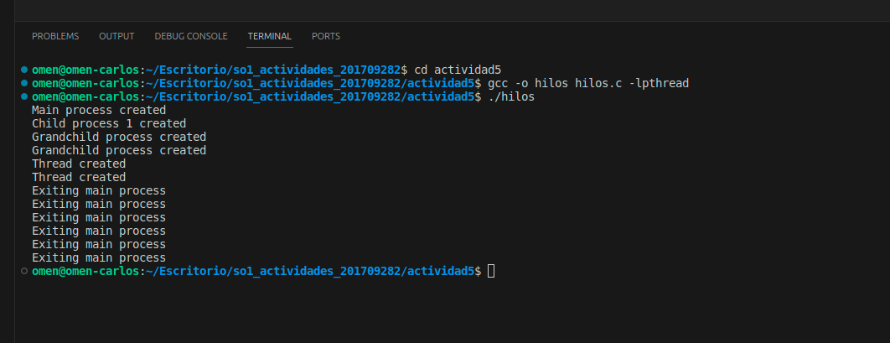

## a) ¿Cuántos procesos únicos son creados?

Main process created indica la creación del proceso principal.
Child process 1 created indica la creación de un hijo del proceso principal.
Grandchild process created indica la creación de un nieto, que es otro proceso.
En total, hay 1 (proceso principal) + 1 (hijo del proceso principal) + 2 (nietos) = 4 procesos únicos creados. Entonces, la respuesta es que deberían ser 4 procesos únicos.

## b) ¿Cuántos hilos únicos son creados?

Se crea un hilo si pid == 0 (es el hijo del primer fork) en el bloque de código donde se llama a pthread_create.
Thread created indica la creación de un hilo. Este mensaje aparece dos veces.
En total, hay 2 hilos únicos creados. 

## Ejecucion del programa creado

